# <div align="center">🍽️ CAL AI - Intelligent Food Analysis Bot</div>

<div align="center">
  
[](https://git.io/typing-svg)


<a href="http://t.me/Product_checkout_bot" target="_blank">
  
</a>
</div>

---

## 📸 What is CAL AI?

**CAL AI** is an intelligent Telegram bot that analyzes food images and provides comprehensive nutritional information, health ratings, and personalized dietary recommendations. Powered by **Google Gemini AI** and automated through **n8n workflows**, it's your pocket nutritionist available 24/7!

```mermaid
graph LR
    A[📱 User Sends Food Image] -->|Telegram| B[🔄 n8n Workflow]
    B --> C[🖼️ Image Processing]
    C --> D[🤖 Google Gemini AI]
    D --> E[📊 Nutrition Analysis]
    E --> F[💬 Detailed Response]
    F -->|Telegram| A
    
    style A fill:#26A5E4
    style D fill:#4285F4
    style E fill:#00D26A
    style F fill:#FFB800
```

<div align="center">
  


</div>

---

## ✨ Key Features

<table>
<tr>
<td width="50%">

### 🔍 **Dish Identification**
- Automatic food recognition
- Main ingredient detection
- Dish name & description

### 📊 **Nutritional Breakdown**
- Calories (kcal) calculation
- Protein, Carbs, Fats analysis
- Micronutrients identification
- Vitamins & Minerals detection

</td>
<td width="50%">

### ⭐ **Health Rating System**
- 0-5 scale rating
- Detailed reasoning
- Expert recommendations

### 👥 **Personalized Suitability**
- Overweight/Obese individuals
- Underweight individuals
- Diabetic patients
- Heart disease patients
- Athletes & active people

</td>
</tr>
</table>

### 🥗 **Alternative Food Suggestions**
- Healthier vegetarian options
- Healthier non-vegetarian options
- Reasoning for each suggestion

---

## 🏗️ Architecture & Workflow

<div align="center">

### **n8n Automation Workflow**

```
┌─────────────────┐     ┌──────────────┐     ┌─────────────┐
│  Telegram       │────▶│   Get File   │────▶│  AI Agent   │
│  Trigger        │     │   (Photo)    │     │  (Gemini)   │
└─────────────────┘     └──────────────┘     └─────────────┘
                                                      │
                                                      ▼
┌─────────────────┐     ┌──────────────────────────────┐
│  Send Response  │◀────│  Structured Output Parser    │
│  (Telegram)     │     │  (JSON Schema)               │
└─────────────────┘     └──────────────────────────────┘
```

</div>

### 🔧 **Components:**

1. **Telegram Trigger** - Listens for incoming messages with photos
2. **Get File Node** - Retrieves the food image from Telegram
3. **AI Agent** - Analyzes image using Google Gemini
4. **Output Parser** - Structures the AI response into JSON
5. **Send Message** - Formats and sends beautiful response back

---

## 🚀 Tech Stack

<div align="center">

### **Core Technologies**


### **AI & Processing**


</div>

---

## 📋 Sample Analysis Output

<div align="center">

### **Example: Cheeseburger Analysis**

</div>

```json
{
  "dish_identification": {
    "name": "Cheeseburger",
    "main_visible_ingredients": [
      "beef patty", "cheese", "bun", "lettuce", "tomato", "mayonnaise"
    ]
  },
  "nutritional_breakdown": {
    "calories_kcal": 850,
    "protein_g": 35,
    "carbohydrates_g": 55,
    "fat_g": 48,
    "notable_micronutrients": [
      "Vitamin B12", "Iron", "Calcium", "Sodium", "Dietary fiber"
    ]
  },
  "health_rating": {
    "score": 2,
    "reason": "High in saturated fat, sodium, and calories..."
  },
  "suitability": {
    "overweight_obese": "Not preferable due to high calorie content",
    "underweight": "Preferable as it is calorie-dense",
    "diabetes": "Not preferable due to refined carbs",
    "hypertension_heart_disease": "Not preferable due to sodium",
    "athletes_active": "Moderately preferable for protein"
  },
  "alternative_food_suggestions": {
    "vegetarian": ["Grilled veggie wrap with hummus..."],
    "non_vegetarian": ["Grilled chicken sandwich..."]
  }
}
```

---

## 🎯 How It Works

<div align="center">

| Step | Action | Description |
|:----:|:------:|:-----------|
| 1️⃣ | **Send Photo** | User sends food image via Telegram |
| 2️⃣ | **Trigger Workflow** | n8n detects incoming message |
| 3️⃣ | **Fetch Image** | Bot retrieves the photo file |
| 4️⃣ | **AI Analysis** | Google Gemini analyzes the food |
| 5️⃣ | **Parse Data** | Structure output into organized JSON |
| 6️⃣ | **Send Results** | Beautiful formatted response sent back |

</div>

---

## 💡 Use Cases

<div align="center">

| 🎯 Purpose | 👥 Target Audience |
|:-----------|:-------------------|
| **Weight Management** | People tracking calories for weight loss/gain |
| **Health Monitoring** | Diabetics, heart patients, hypertension patients |
| **Fitness Tracking** | Athletes and gym enthusiasts |
| **Dietary Planning** | Nutritionists and dietitians |
| **Food Education** | Anyone wanting to learn about nutrition |

</div>

---

## 🛠️ Setup Instructions

### Prerequisites

```bash
✅ n8n (Self-hosted or Cloud)
✅ Telegram Bot Token (via @BotFather)
✅ Google Gemini API Key
✅ Node.js (v16+)
```

### Installation Steps

1. **Import Workflow**
   ```bash
   # Import the CAL AI.json file into your n8n instance
   ```

2. **Configure Credentials**
   - Add Telegram Bot credentials
   - Add Google Gemini API credentials

3. **Activate Workflow**
   - Enable the workflow in n8n
   - Test with a food image

4. **Start Using**
   - Send any food photo to your Telegram bot
   - Receive instant analysis!

---

## 📊 Workflow Configuration

### **AI Agent Prompt**

The bot uses a comprehensive prompt to ensure detailed analysis:

- ✅ Dish identification
- ✅ Ingredient recognition
- ✅ Nutritional calculation
- ✅ Health rating (0-5 scale)
- ✅ Suitability assessment
- ✅ Alternative suggestions
- ✅ Calorie information

### **Structured Output Schema**

JSON schema ensures consistent, parseable responses with:
- Nested objects for organization
- Array handling for lists
- Type validation for accuracy

---

## 🌟 Future Enhancements

<table>
<tr>
<td>

### 🔮 Planned Features
- [ ] Multi-language support
- [ ] Meal planning suggestions
- [ ] Weekly nutrition tracking
- [ ] Recipe recommendations
- [ ] Barcode scanning
- [ ] Restaurant menu analysis

</td>
<td>

### 🚀 Advanced Features
- [ ] Integration with fitness apps
- [ ] Custom dietary preferences
- [ ] Allergy detection
- [ ] Portion size estimation
- [ ] Cost analysis
- [ ] Grocery shopping lists

</td>
</tr>
</table>

---

## 📞 Connect With Me

<div align="center">

[](mailto:kakumanuajitbabu@gmail.com)
[](https://www.linkedin.com/in/kakumanu-ajit-babu-804951334/)
[](https://github.com/nani26-begin)

</div>

---

## 🤝 Contributing

Contributions, issues, and feature requests are welcome!

1. Fork the Project
2. Create your Feature Branch (`git checkout -b feature/AmazingFeature`)
3. Commit your Changes (`git commit -m 'Add some AmazingFeature'`)
4. Push to the Branch (`git push origin feature/AmazingFeature`)
5. Open a Pull Request

---

## 📝 License

This project is created for educational and personal use.

---

## 🙏 Acknowledgments

- **Google Gemini** for powerful AI capabilities
- **n8n** for workflow automation
- **Telegram** for bot platform
- Community contributors and users

---

## 📈 Project Stats

<div align="center">


</div>

---

<div align="center">

### 💚 Show Your Support

Give a ⭐️ if this project helped you!

---

**Made with ❤️ by Kakumanu Ajit Babu**

*"Empowering healthier food choices through AI"*

---


</div>
